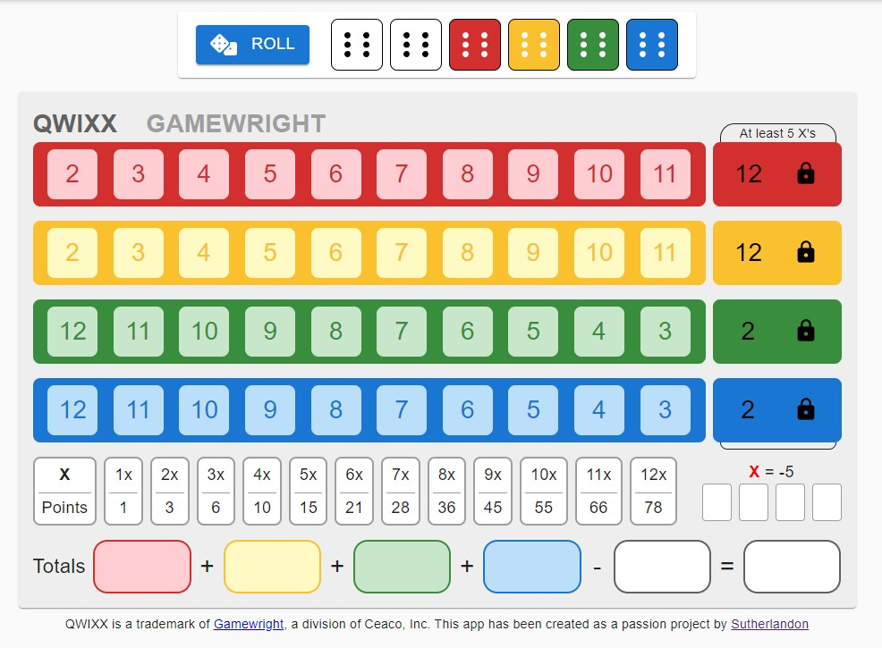

# QWIXX App
QWIXX is a trademark of [Gamewright](https://gamewright.com), a division of Ceaco, Inc.
No copywright infringment is intended by this project.

QWIXX is a table top game played with six dice and score cards.  I enjoyed the game so much
that I built this web app as a passion project. The main goal of this project was to make the
game more accessible because it is not always practical to roll dice, for example, in the car
or on an airplane.  To support that goal, this app scales to any size screen gracefully and
is a Progressive Web App so you can "install" it on your device to have offline access to it
everywhere.  

Originally I had not intended to enforce the rules due to family house rules that I didn't
want to disregard.  However after play tests with people, the feedback I got several times
was they wished the rules were enforced more.  So I implemented some mechanisms to enforce
the rules, but I would like to add a toggle later down the line.  There is a link to the 
game rules included in the app so users can go read up on how to play.

Check it out a [qwixx.sutherlandon.com](https://qwixx.sutherlandon.com)

